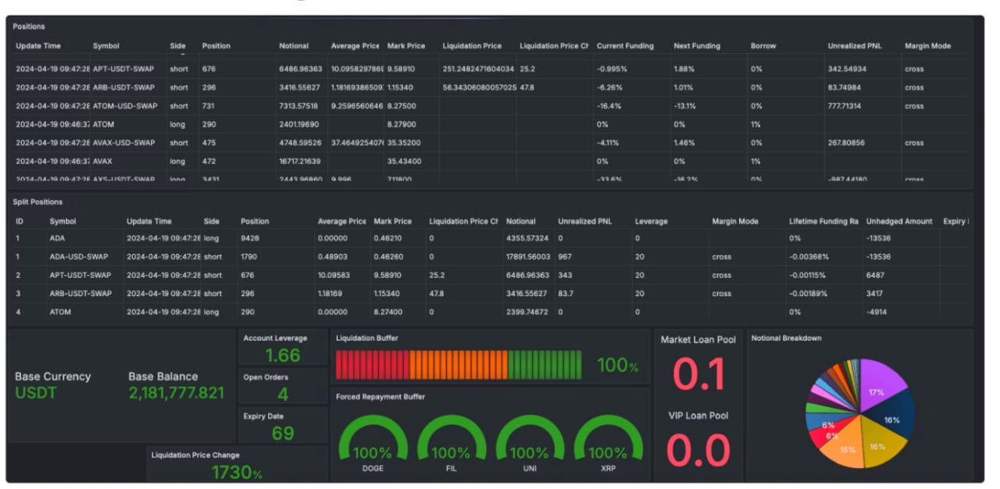

# 🧭 Cryptocurrency Trading Dashboard [Project ID: P-458]

A middleware service that fetches trading data from multiple cryptocurrency exchanges and exposes it to Grafana dashboards via a JSON API.

---

## 📚 Table of Contents

- [About](#about)
- [Features](#features)
- [Tech Stack](#tech-stack)
- [Installation](#installation)
- [Usage](#usage)
- [Configuration](#configuration)
- [Screenshots](#screenshots)
- [API Documentation](#api-documentation)
- [Contact](#contact)
- [Acknowledgements](#acknowledgements)

---

## 🧩 About

This project provides a single backend that aggregates positions, account summaries, and metrics from Binance (Futures, Portfolio Margin) and Bybit (Unified) so you can build one Grafana dashboard for all accounts. It solves the problem of scattered exchange APIs and account types by offering labeled accounts, automatic API detection, and Grafana-compatible endpoints.

---

## ✨ Features

- **Dynamic account management** – Add or remove exchange accounts via configuration without code changes.
- **Labeled accounts** – Custom labels (e.g. SF1, PM1, BY1) for each account in Grafana.
- **Automatic account-type handling** – Uses the correct API (Futures, Portfolio Margin, Unified) per account.
- **Multi-exchange support** – Binance (USDT-M, COIN-M, Portfolio Margin) and Bybit Unified.
- **Periodic data** – Fetches positions, account summary, and metrics on an interval (e.g. every 40 seconds).
- **Grafana-ready** – JSON data source endpoints for tables, variables, and search.

---

## 🧠 Tech Stack

- **Languages:** TypeScript, JavaScript
- **Frameworks:** Express.js, Node.js
- **Database:** None (exchange APIs only)
- **Tools:** npm/yarn, ts-node, nodemon, dotenv

---

## ⚙️ Installation

```bash
# Clone the repository
git clone https://github.com/yourusername/middleware_client.git

# Navigate to the project directory
cd middleware_client

# Install dependencies
npm install
```

---

## 🚀 Usage

```bash
# Start the development server
npm run dev
```

Then open your browser or Grafana and use:

👉 [http://localhost:8080](http://localhost:8080)

For production:

```bash
npm run build
npm start
```

The service listens on port **8080** by default. Override with the `PORT` environment variable.

---

## 🧾 Configuration

Configure accounts in `src/config.ts`. Use environment variables for API keys and secrets.

Create a `.env` file (or set in your environment) with:

```env
# Binance Futures
BINANCE_FUTURES_API_KEY=your-api-key
BINANCE_FUTURES_API_SECRET=your-api-secret

# Binance Portfolio Margin
BINANCE_PM_API_KEY=your-api-key
BINANCE_PM_API_SECRET=your-api-secret

# Bybit
BYBIT_API_KEY=your-api-key
BYBIT_API_SECRET=your-api-secret

# Optional
PORT=8080
```

**Supported account types:**

- **Binance:** `futures` (USDT-M / COIN-M), `portfolioMargin`
- **Bybit:** `unified`

---

## 🖼 Screenshots

Dashboard overview (positions, account summary, buffers, notional breakdown):



---

## 📜 API Documentation

**Grafana data source:**

- `GET /search` – Available metrics for Grafana
- `POST /query` – Position/table data for panels
- `POST /variable` – Account names for variables
- `POST /annotations` – Annotations (empty)

**REST API:**

- `GET /api/available` – List available account names
- `GET /api/accounts` – List all account configs
- `GET /api/accounts/:accountName` – Single account config
- `GET /api/positions/:accountName` – Positions for an account
- `GET /api/account-summary/:accountName` – Account summary
- `GET /api/health` – Health status of all accounts
- `POST /api/accounts` – Add account dynamically

---

## 📬 Contact

- **Author:** enthudebugger
- **Email:** aliffahrurizal@gmail.com
- **GitHub:** @enthudebugger
- **Website/Portfolio:** aliffahrurizal.vercel.app

---

## 🌟 Acknowledgements

- Binance and Bybit APIs for exchange data
- Grafana JSON data source for dashboard integration
- Express and TypeScript communities
